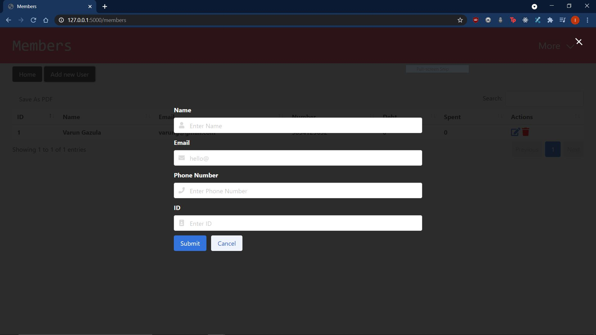
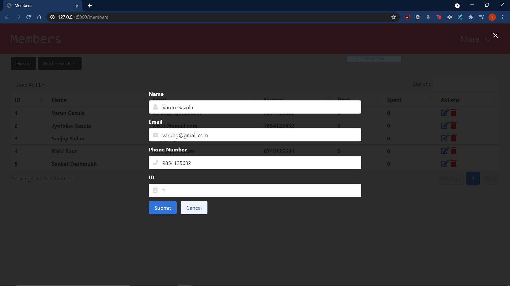

I have created a simple Library management system which is user friendly and includes all basic features

User can view the list of books available in the library along with the default stock of 50 which can be edited at any time.
It displays the book title, author, publisher, pages of the book, avg rating and stock along with actions to edit or delete books. 
User can also insert books by clicking on the "Insert" button and providing the page number.

User can add new members using the "Members" page
They can easily edit the user information if any change is required. 
Mandatory checks are performed and format of Phone number is set to standard(10 digits).
Email id validation is done during creation. ID is unique for every member and hence if a duplicate value is added a meaningful error message is popped. 
I have not kept the ID column as an auto-incramented value because this can be used by a school where every students roll number can be entered here. 
A user can be deleted if the member does not have any active transaction through the button provided on the UI. Similarly, if a member has an active transaction then an error message is displayed for the same.

In the "Transactions" page a user can add transaction against a member and as required delete the transaction too.
If the debt of a member is greater than 500 then they cannot rent anymore books and an error is placed. 
The "Status" column displays if the book is currently on Rent or is returned along with the date of transaction displayed in the "Date" column. 
A transaction can be deleted using the delete button.

2 Reports are created based on Books and Members.
These reports can be downladed by the user. 

A user can easily navigate to the Home page by clicking on the Title from each page.
The dropdown "More" allows user to navigate between pages.

ScreenShots

